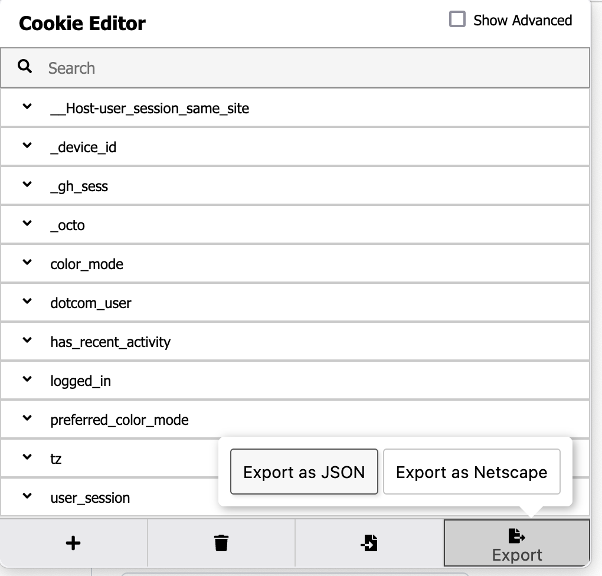

# Swiggy and Zomato Total Money Spent

The python script retrieves all your orders and 
1. Calculates the toal money you spent
2. No of dishes with sort
3. Restrurant list
4. Average Order

on  [swiggy.com](https://www.swiggy.com) and [zomato.com](https://www.zomato.com).

# How to use

The script expects you to give your swiggy session as input.

- Login to swiggy.com or zomato.com on a browser (chrome or firefox)
- Install the [Cookie Editor chrome extension](https://chrome.google.com/webstore/detail/cookie-editor/hlkenndednhfkekhgcdicdfddnkalmdm?hl=en) or the [Cookie Editor firefox extension](https://addons.mozilla.org/en-US/firefox/addon/cookie-editor/)
- Go to the Swiggy tab or Zomato tab and click on the Extension's icon, and select "Export". This will copy your cookies to clipboard
  
- Create a new file called `cookies.json` in the same directory as the `swiggy.py` script or `zomato.py` script and paste the copied cookies into this file.
- Install requirements with `pip`
  ```
  pip install -r requirements.txt
  ```
- Now simply run `swiggy.py` to get swiggy orders

  ```
  python swiggy.py
  ```

- Now simply run `zomato.py` to get zomato orders
  ```
  python zomato.py
  ```
